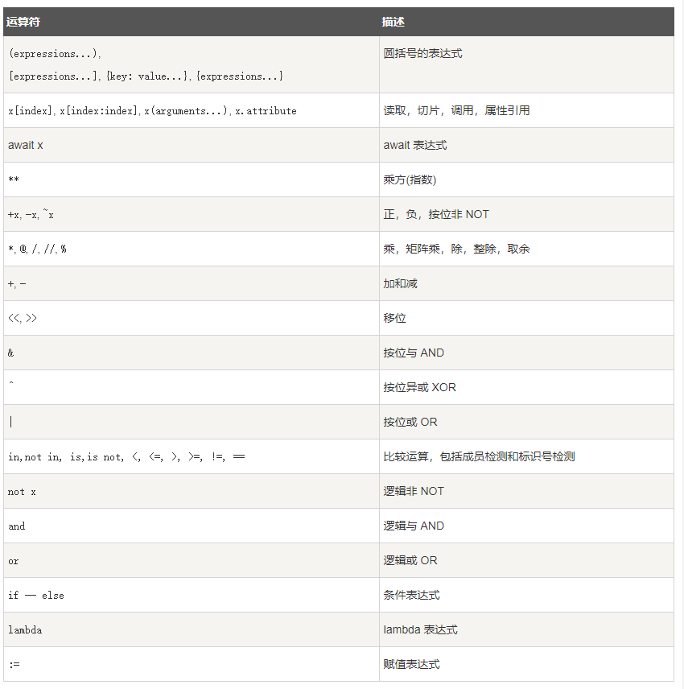

# Python 学习

## 变量和数据类型

1. 变量
    1. 命名规则：
    > 1.只能包含字母、数字和下划线；2.不能包含空格；3.不要用关键词和函数名作为变量名;4.简短且具备描述性；5.慎用小写l和大写字母O
2. 字符串
    > 被单引号、双引号引用的都是字符串
    1. 字符串相关的函数
        ```python {.line-numbers}
        name = ' target '
        name1 = 'TARGET'
        full_name = name +' '+ name1 #合并字符串（中间带有空格）
        print(name.title())     #首字母为大写，其它均为小写进行输出
        print('hello,'+full_name.title())       #合并字符串的空格前后的两个字符串都首字母大写了
        name += "that is my target"     #在name字符串末尾附加一个字符串，如果是数值，就是进行相加
        print('\n''\t')     #\n为换行；\t为制表符
        print(name.rstrip()+name.lstrip()+name.strip())        #删除末尾的空白、删除开头的空白、同时剔除开头和末尾的空白
3. 数字
    1. 整数
    > 1.整数相除时，确保一个为浮点数，这样会保留小数点后的数字；2.整数放在字符串中间被引用如`age=23 message="happy"+age+"rd birthday"`，会报错
    2. 浮点数

## 列表简介

1. 列表
   `bike = ['a','b','c','d']    #bike[0]是第一个元素`
   1. 修改、增添、删除元素
        ```python {.line-numbers}
        bike = ['a','b','c','d']
        bike[0] = 'x'    #将第一个元素换成x
        bike.append('e')     #在最后面扩展一个e
        bike.insert(0,'f')       #在开头位置插入一个f，其他元素像右平移一个位置，适用于任何位置
        del bike[0]         #删除第一个元素，适用于任何位置
        popped_bike = bike.pop()     #将末尾的元素删除，并将末尾的元素赋值给poped_bike
        first_owned = bike.pop(0)    #将开头的元素删除，并将末尾的元素赋值给poped_bike，适用于任何位置
        bike.remove('c')     #当只清楚要删除的内容时，可以用这个
   2. 组织列表
      1. 排序
         ```python {.line-numbers}
         bike = ['a','c','d','b']
         bike.sort()     #永久按字母顺序排序
         bike.sort(reversw=True)     #永久按反向字母顺序排序
         print(sorted(bike))     #临时按字母顺序排序
         bike.reverse()     #排列成原顺序相反的顺序
      2. 长度
         ```python {.line-numbers}
         bike = ['a','c','d','b']
         len(bike)      #长度为其元素数量
2. 操作列表
    1. 遍历列表：`bikes = ['a','c','d','b']  for bike in bikes:`
    2. 创造数字列表：
        ```python {.line-numbers}
        for value in range(1,5)
            print(value)       #只有1，2，3，4
        numbers = list(range(1,6))      #创造了数字列表
        even_numbers = list(range(2,11,2))      #创造首元素为2，步长为2的列表
        min(numbers); max(numbers); sum(numbers)        #最小值、最大值、总和
        number = [value for value in range(1,11)]       #列表解析，创建数字列表
    3. 使用部分列表
        ```python {.line-numbers}
        bikes = ['a','c','d','b']
        print(bikes[0:3])        #第0,1,2号元素
        print(bikes[:3])         #从开头开始，到第2号元素结束
        print(bikes[2:])         #从第2号元素开始，到末尾结束
        print(bikes[-3:])        #输出最后三个元素
        for bike in bikes[1:3]      #遍历切片
        my_bikes = bikes[:]     #将原bikes创建了一个副本赋予my_bikes，两个变量所指的列表不同
        friend_bikes = bikes        #将原bikes赋值给了friend_bikes，两个变量所指的列表相同，改一个两个都变化
    4. 定义元组(**元组不可修改**)
        ```python {.line-numbers}
        dimensions = (1,2,3)        #元组是用圆括号标识的
        for dimension in dimensions:        #遍历元组
            print(dimension)
        dimensions = (4,5,6)        #元组不能被修改，但可以被重新赋值

## 字典

1. 简单字典：`x = {'color': 'green', 'point': 5}  #字典就是一系列键值对，值可以是数字、字符串、列表乃至字典`
2. 访问与修改字典：`x['color']    #访问`；`x['x_position'] = 0  #添加`；`x['color'] = yellow  #修改`；`del x['color']   #删除`
3. 遍历字典
   ```python {.line-numbers}
   x = {'color': 'green', 'point': 5}
   for key, value in x.item():      #遍历所有键值
        print(key); print(value)
   for key in x.keys():     #遍历所有键
   for key in x:        #遍历所有键，默认状态
   for key in sorted(x.keys()):     #按字母顺序遍历所有键
   for value in x.values():     #遍历所有值
4. 字典与列表
   1. 字典列表：`x1 = {'color': 'green', 'point': 5} x2 = {'color': 'green', 'point': 5} x3 = [x1, x2]`
   2. 在字典中储存列表：`x = {'color': ['red', 'green'], 'point': 5} `
   3. 在字典中储存字典：`x = {'color': {'red': 4, 'green': 5}, 'point': 5} `

## 数据
1. 类型的强制转换
   1. 数据类型检测方法：`type()`
   2. 转为字符串类型：`str()` **所有类型数据都可以转换**
   3. 转为整数型和浮点型（均为数值）：`int()`（整数型），`float()`（浮点型）
      1. 数值之间均可以转换
      2. 只有字符串中为纯数字，可以转换
   4. 转为布尔类型：`bool()`（转为False或True）
      1. 容器类型（字符串、列表、元组、字典、集合）：容器空为False，容器非空为True
      2. 非容器类型：整型值为0为False，浮点型值为0.0为False
   5. 转为列表（数字型不能转）：
      1. 字符串转列表：每一个字符为一个元素
      2. 元组转列表：直接转
      3. 字典转列表：只包含键值
      4. 集合转列表：无序
   6. 转元组：和转列表完全相同
   7. 转为集合：和转列表的规则基本相同，只是结果无序
   8. 转为字典（需要二级容器，所以数字型、字符型、集合都不符合要求）：
      1. 列表转字典：有二级容器，且二级容器中的元素个数为2
      2. 元组转字典：同上
2. 数据运算
   1. 运算类型：
      1. 算术运算符：`+,-,*,/,%,**,//`
      2. 比较运算符：`==,!=,>,<,>=,<=`
      3. 赋值运算符：`=,+=,-=,*=,/=,%=,**=,//=`，`:=`（海象运算符，可以在表达式内进行数据赋值）
      4. 位运算符：`&,|,^,~,<<,>>`
      5. 逻辑运算符：`and,or,not`
      6. 成员运算符：`in,not in`
      7. 身份运算符：`is,is not`，is类似`id(a)==id(b)`
   2. 优先级：
      1. 
3. 推导式
   1. 基本形式
      1. 列表推导式：`[out_exp_res for out_exp in input_list if condition]`，out_exp_res：列表生成元素表达式，可以是有返回值的函数；for out_exp in input_list：迭代 input_list 将 out_exp 传入到 out_exp_res 表达式中；if condition：条件语句，可以过滤列表中不符合条件的值。
      2. 字典推导式：`{ key_expr: value_expr for value in collection if condition }`
      3. 集合推导式：`{ expression for item in Sequence if conditional }`
      4. 元组推导式：`(expression for item in Sequence if conditional )`
   2. 其他变式
      1. 生成元素的表达式包含条件：`list2 = [word.title() if word.startswith('p') else word.upper() for word in list1]`
      2. 迭代表达式可以右not in：`for item in list1 not in list2`

## If语句

1. 条件测试
   1. 单个条件
      ```python {.line-numbers}
      age = 18
      if age == 18      #是否相等
      if age > 18       #是否大于18
      if age >= 18      #是否大于等于18
      if age != 18      #是否不等于18
      if age % 2 == 0       #求模运算，%会使两数相除并返回余数
      if age // 2 == 0      #取整
      if game_active = True/False       #布尔表达式
    > Python将在列表至少包含一个元素时返回True，并在列表为空时返回False 
   2. 多个条件
      ```python {.line-numbers}
      if age1 > 18 and age2 > 18        #两个条件均成立
      if age1 > 18 or age2 > 18     #两个条件其中之一成立
   3. 包含条件
      ```python {.line-numbers}
      number = [value for value in range(1,11)]
      a = 1
      if a not in number:   #不包含
        print(number)
2. if-else语句
   1. 简单if（如上）
   2. if-else（在上面的情况后面加一个else的输出）
   3. if-elif（适用于有多个条件下的不同输出，结尾可以有else，也可以没有）
   > if-elif-else结构功能强大，但**仅适合用于只有一个条件满足的情况**：遇到通过了的测试后，Python就跳过余下的测试。

## 用户输入和While循环

1. 函数input()
   1. 工作原理：让程序暂停运行，等待用户输入一些文本。示例：`message = input("Tell me something:")`。值得注意的是，**输入的信息都是字符串格式**，如果要对输入的信息进行数值想滚的判断，需要更改信息的格式
2. while循环
   1. 简介：for循环针对集合中的每一个元素的代码块，while循环时不断循环直到条件不符
        ```python {.line-numbers}
        number = 1
        message = ""
        active = True
        while number <= 5:      #条件不符合跳出
            number += 1
        while message != 'quit':
            message = input("tell me something:")       #输入的条件导致跳出
        while active:       #使用标志
            if message == 'quit'
                active = False
        while message:      #空值为False
        while number in numbers:        #当包含在内
   2. 强制退出和继续
        ```python {.line-numbers}
        while True:
            city = input(“tell me something:")
            if city == 'quit':      
                break       #用break跳出循环，不执行余下的代码。break可以跳出任何循环
        number = 1
        while number < 10:
            number += 1
            if number % 2 == 0:
                continue        #继续循环，不执行余下的代码
            print(number)

## 函数

1. 定义函数：示例为`def greet_user():  print("hello!)`。def是关键字，greet_user()为函数名，括号内指出函数为完成其任务需要怎样的信息，以冒号结尾，后面所有的缩进构成函数体。
   1. 实参和形参
        ```python {.line-numbers}
        def greet_user(username)        #username是一个形参
            print("hello "+usernam.title())
        greet_user('chankey')       #chankey是一个实参，实参可以是数值、字符串、列表、列表副本等
        def name(x, y):
            print(x)
            print(y)
        name(1, 2)      #位置实参（和前面的形参位置要一一对应）
        name(x=1,y=2)       #关键字实参，可以位置不对应，但关键字对应
        def name(x, y=2):       #默认值实参，其中一个形参的值在定义的时候默认了
            print(x)
            print(y)
        name(1)     #默认值实参可以只给出一个没设默认值的
        name(x=1,y=3)；name(1,3)       #默认值不对的时候，可以更改
    2. 返回值
         ```python {.line-numbers}
        def name(x,y):
            z = x + y
            return z        #返回了了两个值的和，当然，也可以返回字符串、字典、表格等
        friend = name(1,2)      #提供了一个变量并储存了返回的值
        #在实际应用的过程中，可能有的时候需要传递一个参数，有的时候需要传递两个参数，可以将其中之一设置为默认，在定义的函数中加入判断条件，进行不同的返回
    3. 传递任意数量的实参
        ```python {.line-numbers}
        def name(x,*y)        #*y创建了一个空元组，可以往空元组中放入任意数量的值
        name(1,2)
        name(1,2,3)
        def name(x,**y)       #**y创建了一个空字典
    4. 将函数储存在模块中
       1. 模块创建和导入函数：创建一个包含函数name的文件“name.py”，然后在新的文件中输入`import name`，之后就能采用该函数`name.name()`（前面是文件名，后面是函数名）顺畅的调用该name函数了
       2. 导入特定/全部函数：`from name import name, name1`（特定）,`from name import *`（全部），这种情况**可以不加文件名调用**
       3. 给函数或模块制定别名（避免命名冲突或方便一些）：`from name import name as n`(函数指定)，`import name as na`（模块指定）

## 类

1. 创建和使用类：使用类可以定义任何事物。示例：所有小狗都会蹲下和打滚（除了有名字和年龄外）
   1. 创建
        ```python {.line-numbers}
        class Dog()     #类的首字母一般是大写
            def _init_(self, name, age):        #类中的函数称为方法,这是一种约定方法，其中self必不可少，Python会自动为其传参，所以我们只需要传递name和age
                self.name = name
                self.age = age
                self.color = 'green'      #当给类中的某个属性设置了默认值，就不需要为他传参了
            def sit(self)       #这个方法定义坐下
                print(self.name.title()+"is now sitting")
            def rollover(self)      #这个方法定义打滚
                print(self.name.title()+" rolled over")
    2. 调用
        ```python {.line-numbers}
        my_dog = Dog("xiaoqiang", 5)        #不需要return语句，会自动返回这个值
        print(my_dog.name)      #访问属性
        my_dog.sit()        #使用类之后，就可以用句点表示法调用该类中的所有方法
        my_dog.rollover()
    3. 继承：子类有父类的所有方法，还有自己额额外的特殊方法。此外，**可以在定义类的属性中，将另一个类赋予该属性，形成嵌套，避免混乱不堪**
        ```python {.line-numbers}
        class Dog()
        --snip--
        class Bigdog(Dog)   #定义子类
            def _init_(self, name, age)     #接收父类创建所需要的信息
                super()._init_(name, age)   #super函数将子类和父类关联起来
                self.size = 'big'           #添加子类特有的信息
            def size(self):         #定义一个子类特有的方法，还可以重新改写父类中的方法，以去掉没必要的描述
                print("this is a "+self.size+" dog")
2. 导入
   1. 模块创建：将定义的所有类放在一个模块中，命名为“dog.py”
   2. 从模块中导入一个或者多个或者所有类（参考先前的导入函数）
   3. 从模块中导入模块，一个子类的模块需要导入父类的模块

## 文件和异常

1. 从文件中读取数据
    1. 文件路径
        1. 相对路径：程序文件和保存文本的文件夹在一个大文件夹中（`with open ('text_file\filename.txt')`
        2. 绝对路径：保存文本的全部路径，可以调用系统任何地方的文件（`with open('C:\User\other_files\text_files\filename.txt')`）
    2. 读取整个文件
        ```python {.line-numbers}
        with open('pi_digits.txt') as file_project:      #函数open接受一个需要访问的文件名称，它返回表示该文件的对象，并储存在后面的变量中
            content = file_project.read()       #用read（）读取文件的全部内容，并存在content里
            for line in file_project:       #逐行读取
            print(line)
            lines = file_project.readlines()        #readlines读取一行后存在列表里，最后的列表存在lines变量中
            for line in lines:
                pi_string += line.strip()
2. 写入文件
   1. 空文件和写入
        ```python {.line-numbers}
        filename = 'programming.txt'
        with open(filename, 'w') as file_project:       #如果是空文件，就会创建一个。如果是一个已经存在的文件，会在返回文件前清空该文件。'w'表示写入模式打开；'r'表示读取模式；'a'表示附加模式；'r+'表示读取和写入模式。默认为只读
            file_project.write("I Love programming")        #将字符串写入文件
    2. 附加：原文件内容不变，只是在末尾写入新内容。`with open(filename, 'a') as file_project`
3. 异常
   1. try-except代码块：当清楚可能引发的异常，我们使用这样的代码让异常状况下给出友好的错误消息，而不是traceback。避免用户在使用时看不懂错误原因，或者别有用心这看到不该看的信息
        ```python {.line-numbers}
        try:
            print(5/0)      #尝试运行try代码块中的数据，没有问题跳过except
        except ZeroDivisionError:       #除了除数错误外，还有FileNotFoundError（找不到文件）
            print("you can't divide by zero")
    2. else代码块
        ```python {.line-numbers}
        try:
            answer = int(number1)/int(number2)
        except ZeroDivisionError:
            print("you can't divide by zero")
        else        #try代码块运行成功输出这个
            print(answer)
    3. pass语句 `except ZeroDivisionError:  pass  #出错时什么都不做`
4. 存储数据（json）：程序把用户的数据存在列表和字典等数据结构中，用户关闭程序需要保存下来，可以用json模块来保存
   1. 使用json.dump()和json.load()
        ```python {.line-numbers}
        import json
        numbers = [2,3,4,5,6]
        filename = 'numbers.json'
        with open(filename) as f_object:
            json.dump(numbers, f_object)        #json.dump需要两个参数，一个是要存的数据，一个是存的文件名字
        with open(filename) as f_ob:
            numbers = json.load(f_ob)       #json.load只需要json文件

## 测试代码
1. 测试函数：包括测试用例（一组单元测试）和全覆盖测试（一整套单元测试）。以下例子只运行了一个测试，还可以根据要测试的函数增加其他测试
   ```python {.line-numbers}
   import unittest      #该模块是测试工具
   from name_function import get_formatted_name
   class NameTestCase(unittest.TestCase):       #创建子类
        def  test_first_last_name(self):        #定义一个测试方法,以test打头
            formatted_name = get_formatted_name("jane", "jack")     #测试的函数
            self.assertEqual(formatted_name, "Jane Jack")       #断言方法，判断结果和我们预期的是否一致。还有其它断言方法assertNotEqual(a,b),assertTrue(x),assertFalse(x),assertIn(item,list),assertNotIn(item,list)
    unittest.main()     #让Python运行这个程序中的测试
2. 测试类：和测试函数大同小异，有多个方面可以被测试
    ```python {.line-numbers}
    import unittest
    from survey import AnonymousSurvey
    class TestAnonymousSurvey(unittest.TestCase):
        def setUp(self)     #用setUp创建了一个调查对象和答案列表，为后面节省了很多事
            question = "what is your name?"
            self.my_survey = AnonymousSurvey(question)
            self.responses = ['jane', 'Jack', 'jine']
        def test_store_single_name(self):
            self.my_survey.store_response(self.responses[0])
            self.assertIn(self.responses[0], self.my_survey.responses)
        def test_store_single_name(self):
            for response in self.responses:
                self.my_survey.store_response(response)
            for response in self.responses:
                self.assertIn(response, self.my_survey.responses)